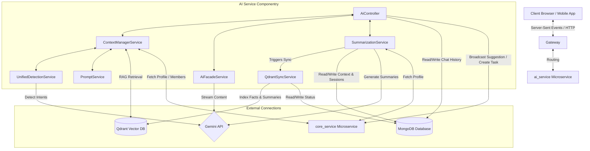
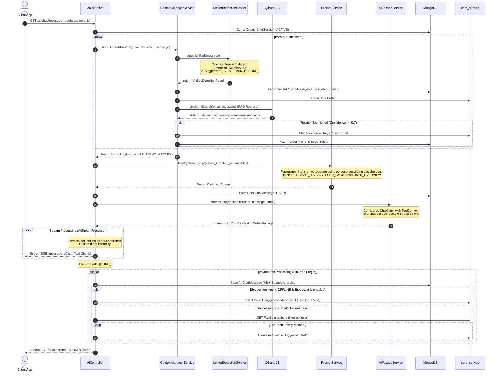
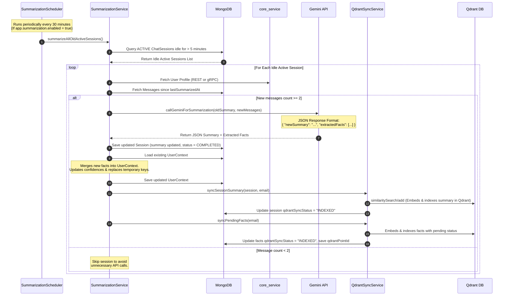

# Familier AI Chat Architecture & Abstract Flow Diagram

This document outlines the architecture, data models, and flow processes for the AI-powered chat and contextual memory feature in the **Familier** project.

---

## 1. Architectural Overview

The AI Chat system is implemented in the `ai_service` microservice, built on **Spring Boot (WebFlux)** utilizing reactive streams to handle non-blocking HTTP Server-Sent Events (SSE) and asynchronous operations.

### Core Components

1. **[AiController](../ai_service/src/main/java/com/familier/ai/controller/AiController.java)**: Exposes reactive REST endpoints for streaming chat responses, retrieving chat histories, collecting feedback, and manually triggering summarizations.
2. **[ContextManagerService](../ai_service/src/main/java/com/familier/ai/service/ContextManagerService.java)**: Orchestrates variables for prompt construction. It queries user profiles, session histories, recent messages, and maps any mentioned family relations to their email addresses. It also executes **RAG retrieval** via semantic search against Qdrant.
3. **[UnifiedDetectionService](../ai_service/src/main/java/com/familier/ai/service/UnifiedDetectionService.java)**: Analyzes user input via a lightweight model (`gemini-2.5-flash-lite`) to classify mentions and suggestions in parallel.
4. **[PromptService](../ai_service/src/main/java/com/familier/ai/service/PromptService.java)**: Manages template-based prompts (e.g. [virtual_member_v4.txt](../ai_service/src/main/resources/prompts/virtual_member_v4.txt)), injecting dynamic user facts and conditional syntax guidelines based on the detected suggestion category (e.g., `EVENT`, `TASK`, `OFFLINE`).
5. **[AiFacadeService](../ai_service/src/main/java/com/familier/ai/service/AiFacadeService.java)**: Streams chat generation using Spring AI's ChatClient with built-in resiliency features (Resilience4j Circuit Breakers and Retries).
6. **[QdrantSyncService](../ai_service/src/main/java/com/familier/ai/service/QdrantSyncService.java)**: Background service that runs after Mongo writes to embed and sync pending facts and chat session summaries to Qdrant.
7. **[SummarizationService](../ai_service/src/main/java/com/familier/ai/service/SummarizationService.java)**: A background process that periodically extracts key facts, updates the persistent user memory context, and closes idle chat sessions.
8. **[UserProvider](../ai_service/src/main/java/com/familier/ai/service/provider/UserProvider.java)** (implemented by [RestUserProvider](../ai_service/src/main/java/com/familier/ai/service/provider/RestUserProvider.java) and [GrpcUserProvider](../ai_service/src/main/java/com/familier/ai/service/provider/GrpcUserProvider.java)): Interface for fetching profile data from the `core_service`.

---

## 2. Core Data Models (MongoDB)

### [ChatSession](file:///D:/job_prep/familier/ai_service/src/main/java/com/familier/ai/entity/ChatSession.java)
Represents an ongoing chat thread with the AI assistant.
* `id` (String): Unique identifier.
* `userEmail` (String): Owner of the session.
* `targetContext` (String): Snippet of the first user message.
* `summary` (String): Generated session summary of the conversation history.
* `status` (String): `"ACTIVE"` or `"COMPLETED"`.
* `qdrantSyncStatus` (String): Indexing state for session summary RAG (`"PENDING"`, `"INDEXED"`).
* `createdAt` (Instant): Creation timestamp.
* `lastUpdate` (Instant): Last user/AI message timestamp.
* `lastSummarizedAt` (Instant): Last summarization runtime timestamp.

### [ChatMessage](file:///D:/job_prep/familier/ai_service/src/main/java/com/familier/ai/entity/ChatMessage.java)
Represents a single message inside a chat session.
* `id` (String): Message identifier.
* `sessionId` (String): Associated session ID.
* `sender` (Enum): `USER` or `AI`.
* `content` (String): Text message (rendered to the user).
* `suggestions` (List<String>): Direct quick-replies (e.g., follow-up questions).
* `timestamp` (Instant): Creation timestamp.

### [UserContext](file:///D:/job_prep/familier/ai_service/src/main/java/com/familier/ai/entity/UserContext.java)
Houses long-term memory facts extracted from user interactions to hyper-personalize AI responses.
* `email` (String): Associated user.
* `userOverview` (String): Global overarching context summary (renamed from `globalContext`).
* `facts` (List<Fact>): Dynamic collection of extracted key-value memories.
  * **Fact Properties**:
    * `key` (String): Category key.
    * `value` (String): Context value.
    * `confidence` (Double): Detection confidence ($0.0 - 1.0$).
    * `category` (String): `"PERMANENT"` or `"TEMPORARY"`.
    * `qdrantSyncStatus` (String): Indexing state for vector retrieval (`"PENDING"`, `"INDEXED"`).
    * `qdrantPointId` (String): Correlating point UUID inside Qdrant collection.
    * `updatedAt` (Instant): Last modification time.

---

## 3. Abstract Flow Diagram: AI Chat Execution

This flow outlines how the server processes a client message, enriches the prompt context (including RAG history retrieval from Qdrant), streams the response, and triggers side-effect events.

---

## 4. Abstract Flow Diagram: Summarization & Context Memory Pipeline

This pipeline runs asynchronously via a scheduler. It is responsible for summarizing conversations, extracting long-term facts to MongoDB, and triggering the QdrantSyncService to keep Qdrant vectors up to date.

---

## 5. Summary of Architecture Strengths & Logic Flow

1. **Stateful Chunk Parsing**: The controller utilizes a stateless SSE stream connection but coordinates with an internal state-preserving helper (`AiStreamProcessor`). This processor cleanly separates user-visible tokens from JSON payloads (`<suggestions>`) to prevent rendering technical configuration markup on client screens.
2. **Context Enrichment Loop & RAG**: By coupling real-time semantic detection (for mentions & intents) with stored background summaries, user facts, and **Qdrant-driven semantic memory retrieval (RAG)**, the AI prompt engine can synthesize hyper-personalized text references to other family members (e.g., identifying when the user's father has a health issue and customizing suggestion prompts dynamically).
3. **Thread-Safe Context Propagation**: Rather than relying on fragile `ThreadLocal` context which gets lost across reactive scheduler boundaries in WebFlux, the service utilizes Spring AI's native `ToolContext` parameter injection. This guarantees the user's identity is safely propagated all the way into background-thread custom tool executions.
4. **Resilience Strategy**: Gemini API calls are protected by circuit breakers and retries. Failures automatically fall back to hardcoded empathic messages, ensuring client connection failures are handled gracefully without spilling error traces into user interfaces.
5. **Robust Boundary Verification**: Every custom AI tool has explicit type/null checks at its entry boundary. Exceptions are caught, logged with full stack traces on the server, and returned to Spring AI as clean structured JSON `{"success": false, "errorCode": "..."}` responses, preventing client connection crashes.
